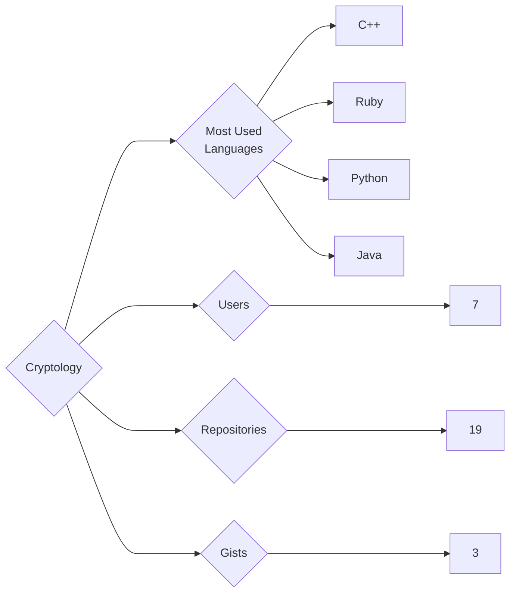

<h1 align="center">Cryptology</h1>

```mermaid
graph LR
COMPANY_NAME{Cryptology}
COMPANY_NAME ---> U{Users} ---> UN[7]
COMPANY_NAME ---> R{Repositories} ---> RN[19]
COMPANY_NAME ---> G{Gists} ---> GN[3]
COMPANY_NAME ---> ML{Most Used<br>Languages}
ML --> C++[C++]
ML --> Ruby[Ruby]
ML --> Python[Python]
ML --> Java[Java]
```
