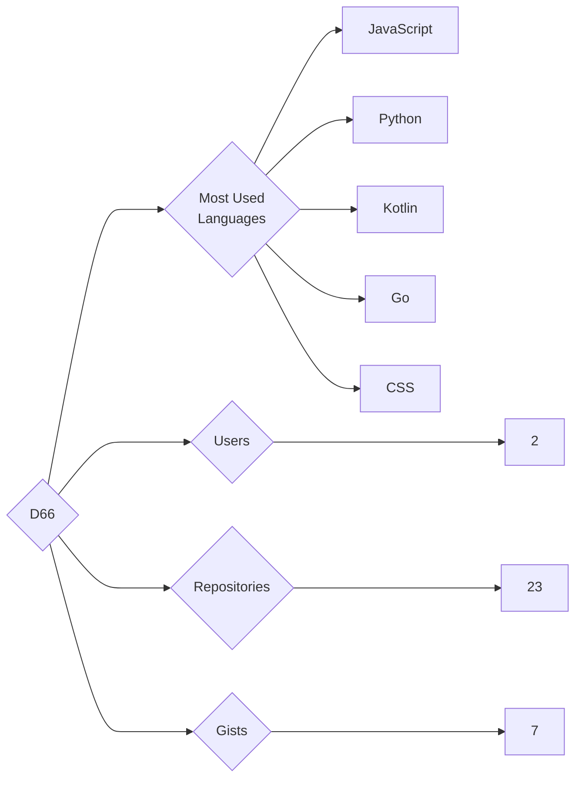

<h1 align="center">D66</h1>

```mermaid
graph LR
COMPANY_NAME{D66}
COMPANY_NAME ---> U{Users} ---> UN[2]
COMPANY_NAME ---> R{Repositories} ---> RN[23]
COMPANY_NAME ---> G{Gists} ---> GN[7]
COMPANY_NAME ---> ML{Most Used<br>Languages}
ML --> JavaScript[JavaScript]
ML --> Python[Python]
ML --> Kotlin[Kotlin]
ML --> Go[Go]
ML --> CSS[CSS]
```
