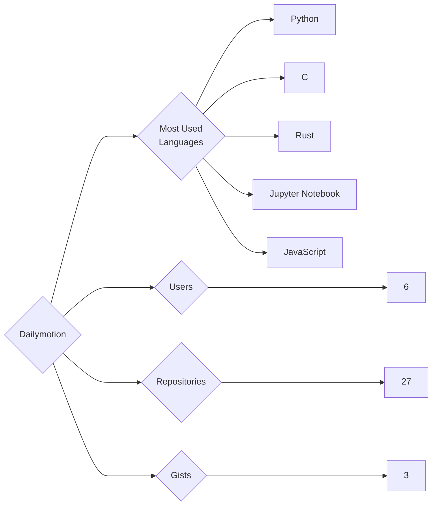

<h1 align="center">Dailymotion</h1>

```mermaid
graph LR
COMPANY_NAME{Dailymotion}
COMPANY_NAME ---> U{Users} ---> UN[6]
COMPANY_NAME ---> R{Repositories} ---> RN[27]
COMPANY_NAME ---> G{Gists} ---> GN[3]
COMPANY_NAME ---> ML{Most Used<br>Languages}
ML --> Python[Python]
ML --> C[C]
ML --> Rust[Rust]
ML --> Jupyter_Notebook[Jupyter Notebook]
ML --> JavaScript[JavaScript]
```
