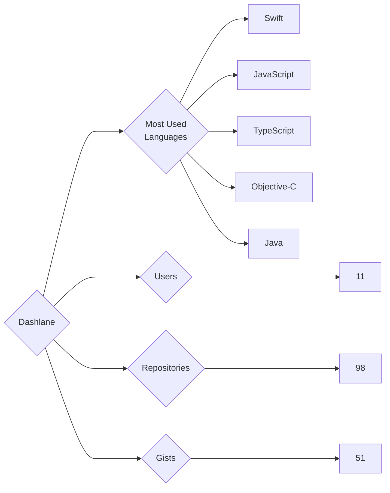

<h1 align="center">Dashlane</h1>

```mermaid
graph LR
COMPANY_NAME{Dashlane}
COMPANY_NAME ---> U{Users} ---> UN[11]
COMPANY_NAME ---> R{Repositories} ---> RN[98]
COMPANY_NAME ---> G{Gists} ---> GN[51]
COMPANY_NAME ---> ML{Most Used<br>Languages}
ML --> Swift[Swift]
ML --> JavaScript[JavaScript]
ML --> TypeScript[TypeScript]
ML --> Objective-C[Objective-C]
ML --> Java[Java]
```
