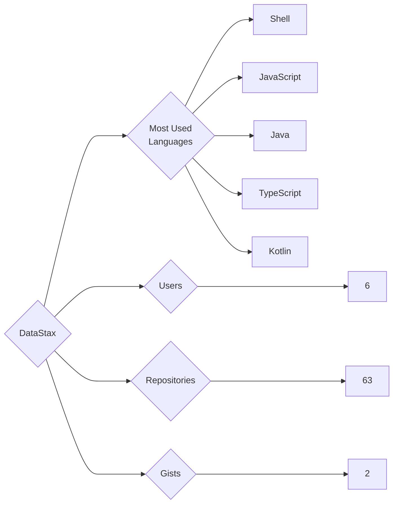

<h1 align="center">DataStax</h1>

```mermaid
graph LR
COMPANY_NAME{DataStax}
COMPANY_NAME ---> U{Users} ---> UN[6]
COMPANY_NAME ---> R{Repositories} ---> RN[63]
COMPANY_NAME ---> G{Gists} ---> GN[2]
COMPANY_NAME ---> ML{Most Used<br>Languages}
ML --> Shell[Shell]
ML --> JavaScript[JavaScript]
ML --> Java[Java]
ML --> TypeScript[TypeScript]
ML --> Kotlin[Kotlin]
```
