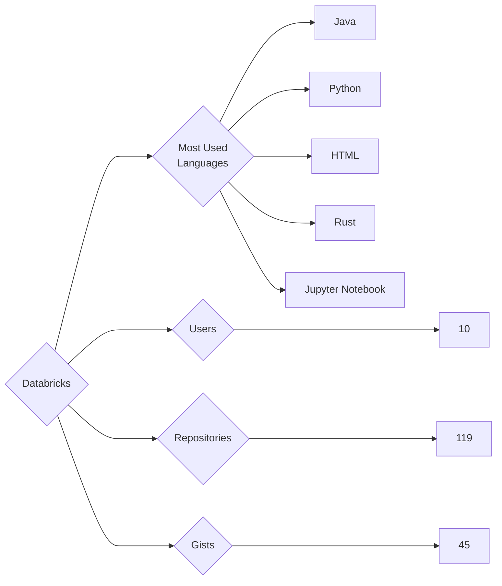

<h1 align="center">Databricks</h1>

```mermaid
graph LR
COMPANY_NAME{Databricks}
COMPANY_NAME ---> U{Users} ---> UN[10]
COMPANY_NAME ---> R{Repositories} ---> RN[119]
COMPANY_NAME ---> G{Gists} ---> GN[45]
COMPANY_NAME ---> ML{Most Used<br>Languages}
ML --> Java[Java]
ML --> Python[Python]
ML --> HTML[HTML]
ML --> Rust[Rust]
ML --> Jupyter_Notebook[Jupyter Notebook]
```
