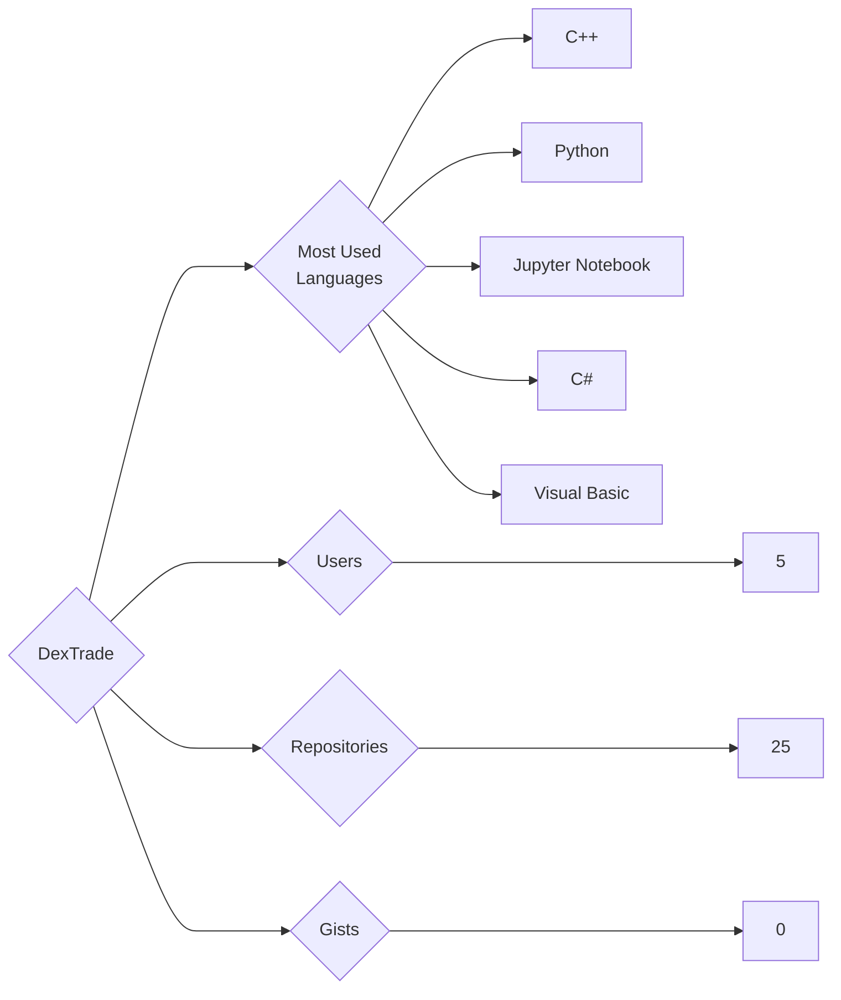

<h1 align="center">DexTrade</h1>

```mermaid
graph LR
COMPANY_NAME{DexTrade}
COMPANY_NAME ---> U{Users} ---> UN[5]
COMPANY_NAME ---> R{Repositories} ---> RN[25]
COMPANY_NAME ---> G{Gists} ---> GN[0]
COMPANY_NAME ---> ML{Most Used<br>Languages}
ML --> C++[C++]
ML --> Python[Python]
ML --> Jupyter_Notebook[Jupyter Notebook]
ML --> C#[C#]
ML --> Visual_Basic[Visual Basic]
```
