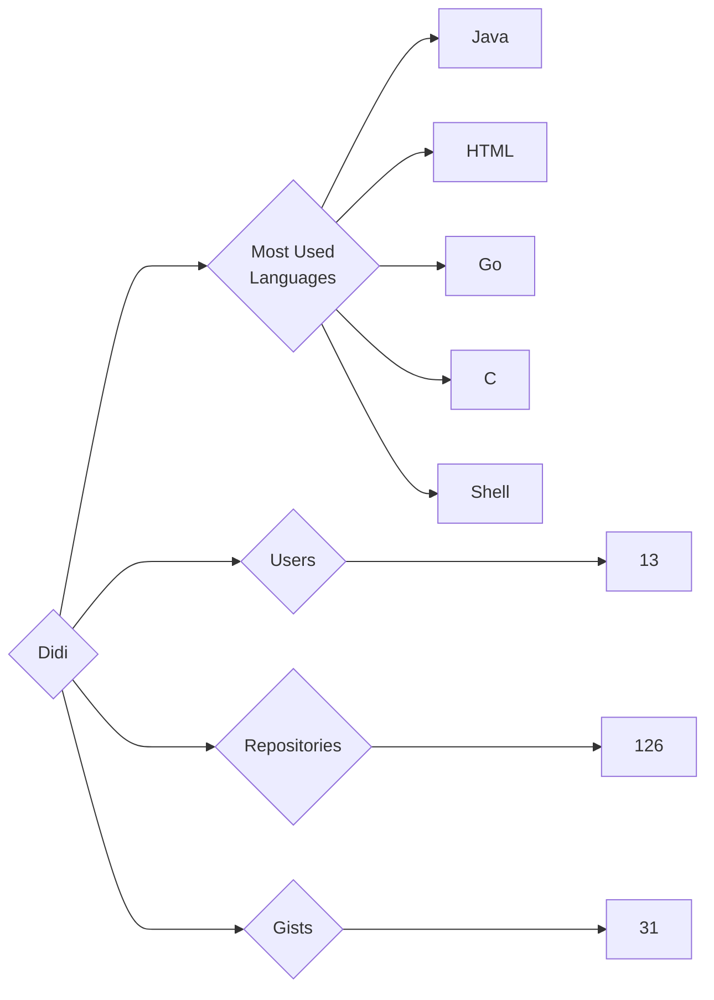

<h1 align="center">Didi</h1>

```mermaid
graph LR
COMPANY_NAME{Didi}
COMPANY_NAME ---> U{Users} ---> UN[13]
COMPANY_NAME ---> R{Repositories} ---> RN[126]
COMPANY_NAME ---> G{Gists} ---> GN[31]
COMPANY_NAME ---> ML{Most Used<br>Languages}
ML --> Java[Java]
ML --> HTML[HTML]
ML --> Go[Go]
ML --> C[C]
ML --> Shell[Shell]
```
