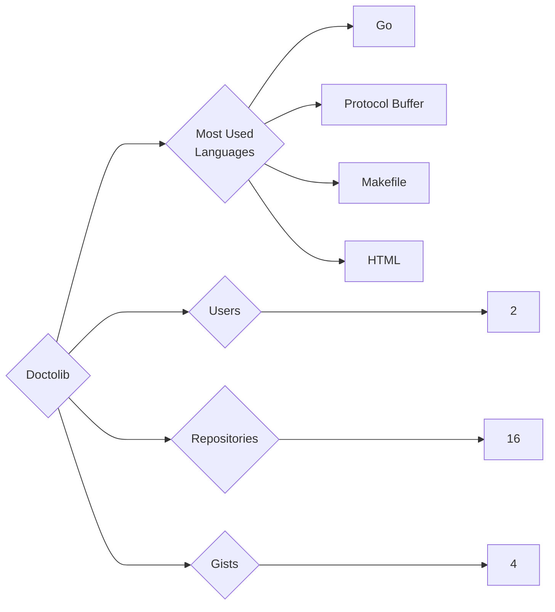

<h1 align="center">Doctolib</h1>

```mermaid
graph LR
COMPANY_NAME{Doctolib}
COMPANY_NAME ---> U{Users} ---> UN[2]
COMPANY_NAME ---> R{Repositories} ---> RN[16]
COMPANY_NAME ---> G{Gists} ---> GN[4]
COMPANY_NAME ---> ML{Most Used<br>Languages}
ML --> Go[Go]
ML --> Protocol_Buffer[Protocol Buffer]
ML --> Makefile[Makefile]
ML --> HTML[HTML]
```
