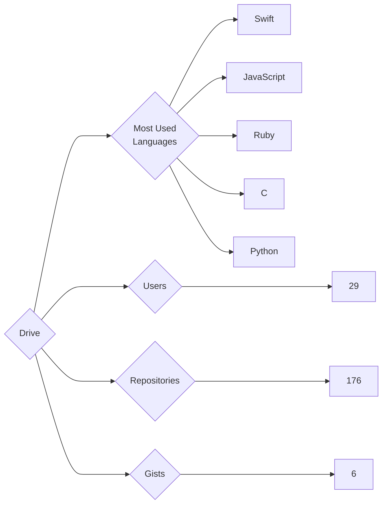

<h1 align="center">Drive</h1>

```mermaid
graph LR
COMPANY_NAME{Drive}
COMPANY_NAME ---> U{Users} ---> UN[29]
COMPANY_NAME ---> R{Repositories} ---> RN[176]
COMPANY_NAME ---> G{Gists} ---> GN[6]
COMPANY_NAME ---> ML{Most Used<br>Languages}
ML --> Swift[Swift]
ML --> JavaScript[JavaScript]
ML --> Ruby[Ruby]
ML --> C[C]
ML --> Python[Python]
```
