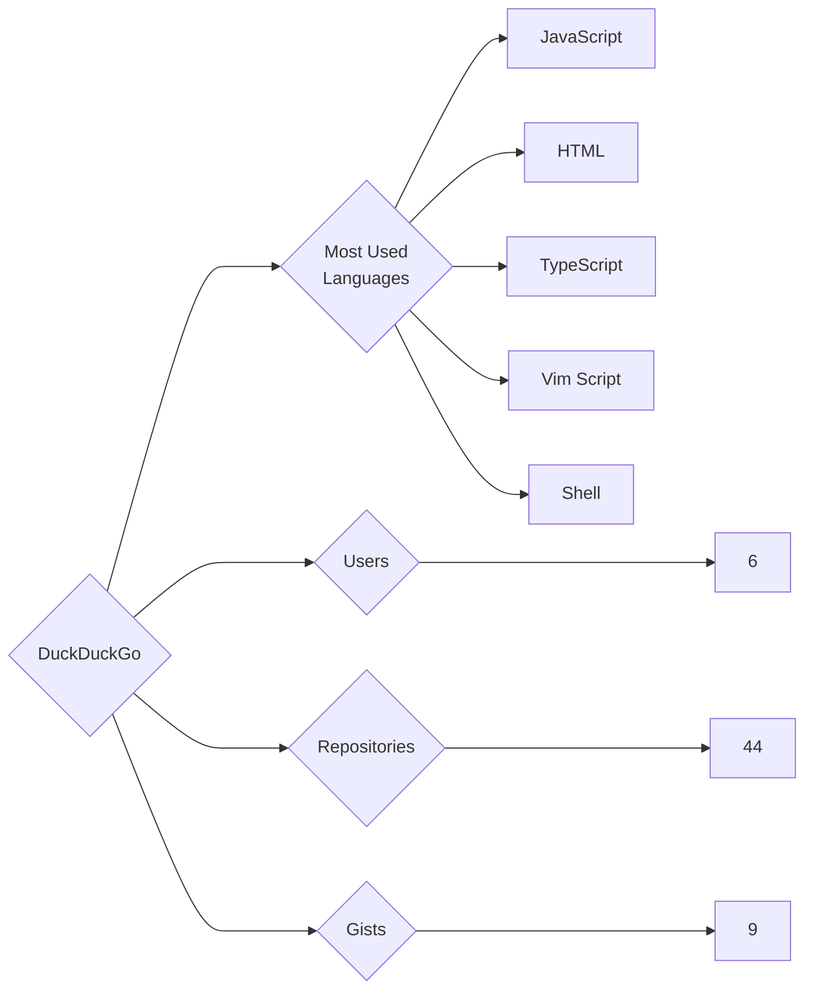

<h1 align="center">DuckDuckGo</h1>

```mermaid
graph LR
COMPANY_NAME{DuckDuckGo}
COMPANY_NAME ---> U{Users} ---> UN[6]
COMPANY_NAME ---> R{Repositories} ---> RN[44]
COMPANY_NAME ---> G{Gists} ---> GN[9]
COMPANY_NAME ---> ML{Most Used<br>Languages}
ML --> JavaScript[JavaScript]
ML --> HTML[HTML]
ML --> TypeScript[TypeScript]
ML --> Vim_Script[Vim Script]
ML --> Shell[Shell]
```
