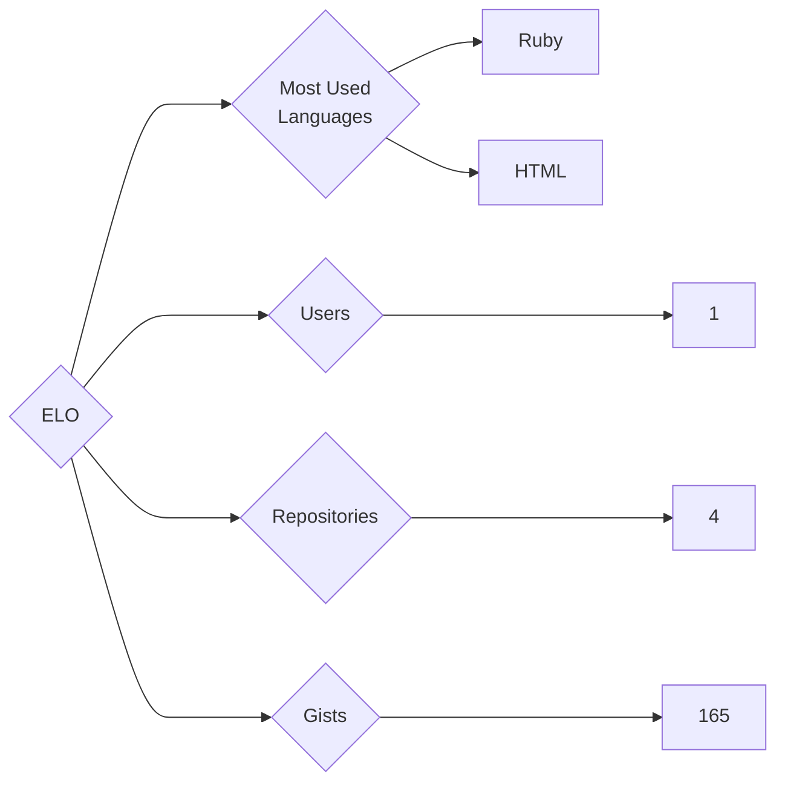

<h1 align="center">ELO</h1>

```mermaid
graph LR
COMPANY_NAME{ELO}
COMPANY_NAME ---> U{Users} ---> UN[1]
COMPANY_NAME ---> R{Repositories} ---> RN[4]
COMPANY_NAME ---> G{Gists} ---> GN[165]
COMPANY_NAME ---> ML{Most Used<br>Languages}
ML --> Ruby[Ruby]
ML --> HTML[HTML]
```
