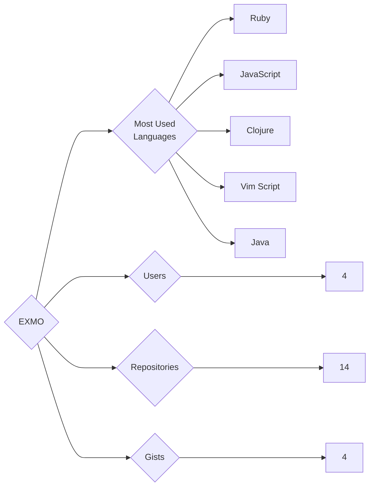

<h1 align="center">EXMO</h1>

```mermaid
graph LR
COMPANY_NAME{EXMO}
COMPANY_NAME ---> U{Users} ---> UN[4]
COMPANY_NAME ---> R{Repositories} ---> RN[14]
COMPANY_NAME ---> G{Gists} ---> GN[4]
COMPANY_NAME ---> ML{Most Used<br>Languages}
ML --> Ruby[Ruby]
ML --> JavaScript[JavaScript]
ML --> Clojure[Clojure]
ML --> Vim_Script[Vim Script]
ML --> Java[Java]
```
