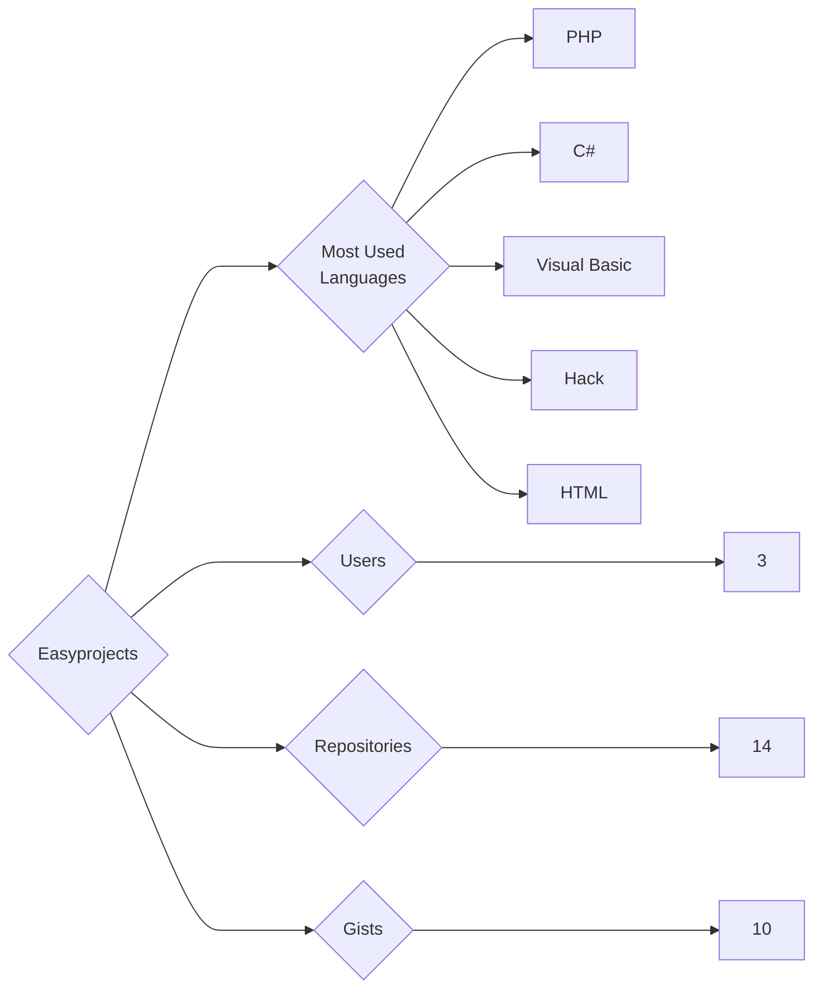

<h1 align="center">Easyprojects</h1>

```mermaid
graph LR
COMPANY_NAME{Easyprojects}
COMPANY_NAME ---> U{Users} ---> UN[3]
COMPANY_NAME ---> R{Repositories} ---> RN[14]
COMPANY_NAME ---> G{Gists} ---> GN[10]
COMPANY_NAME ---> ML{Most Used<br>Languages}
ML --> PHP[PHP]
ML --> C#[C#]
ML --> Visual_Basic[Visual Basic]
ML --> Hack[Hack]
ML --> HTML[HTML]
```
