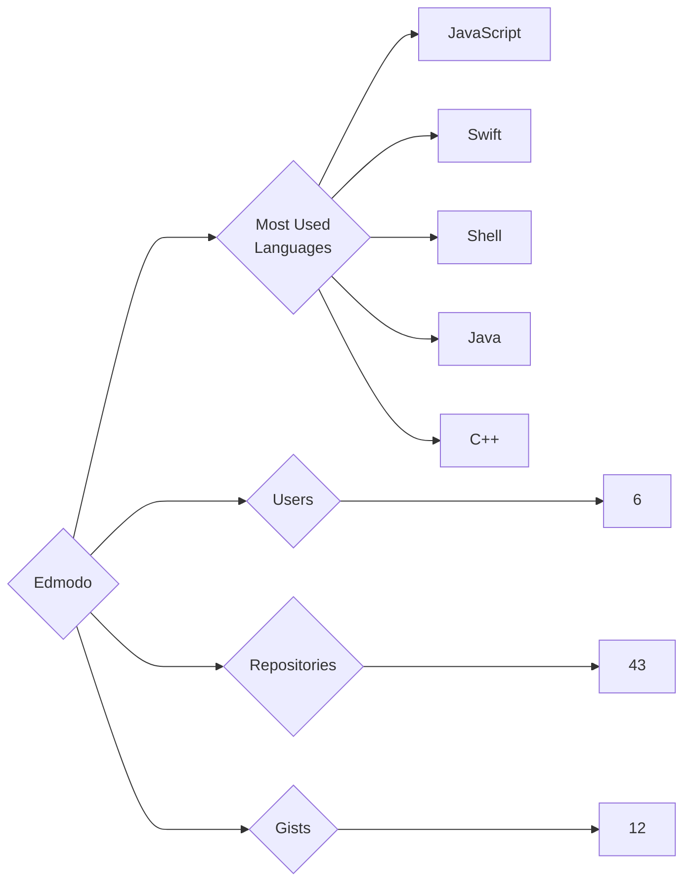

<h1 align="center">Edmodo</h1>

```mermaid
graph LR
COMPANY_NAME{Edmodo}
COMPANY_NAME ---> U{Users} ---> UN[6]
COMPANY_NAME ---> R{Repositories} ---> RN[43]
COMPANY_NAME ---> G{Gists} ---> GN[12]
COMPANY_NAME ---> ML{Most Used<br>Languages}
ML --> JavaScript[JavaScript]
ML --> Swift[Swift]
ML --> Shell[Shell]
ML --> Java[Java]
ML --> C++[C++]
```
