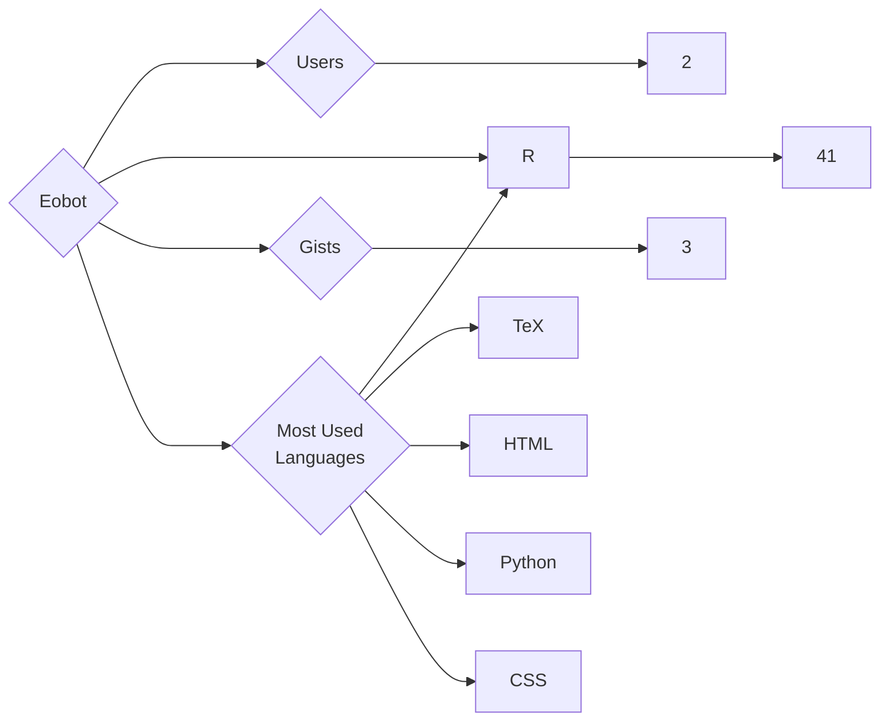

<h1 align="center">Eobot</h1>

```mermaid
graph LR
COMPANY_NAME{Eobot}
COMPANY_NAME ---> U{Users} ---> UN[2]
COMPANY_NAME ---> R{Repositories} ---> RN[41]
COMPANY_NAME ---> G{Gists} ---> GN[3]
COMPANY_NAME ---> ML{Most Used<br>Languages}
ML --> R[R]
ML --> TeX[TeX]
ML --> HTML[HTML]
ML --> Python[Python]
ML --> CSS[CSS]
```
