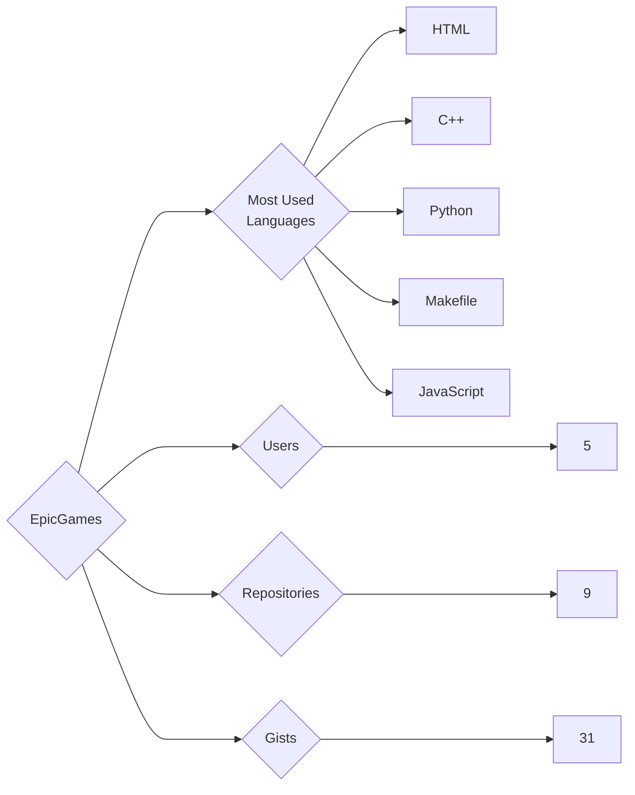

<h1 align="center">EpicGames</h1>

```mermaid
graph LR
COMPANY_NAME{EpicGames}
COMPANY_NAME ---> U{Users} ---> UN[5]
COMPANY_NAME ---> R{Repositories} ---> RN[9]
COMPANY_NAME ---> G{Gists} ---> GN[31]
COMPANY_NAME ---> ML{Most Used<br>Languages}
ML --> HTML[HTML]
ML --> C++[C++]
ML --> Python[Python]
ML --> Makefile[Makefile]
ML --> JavaScript[JavaScript]
```
