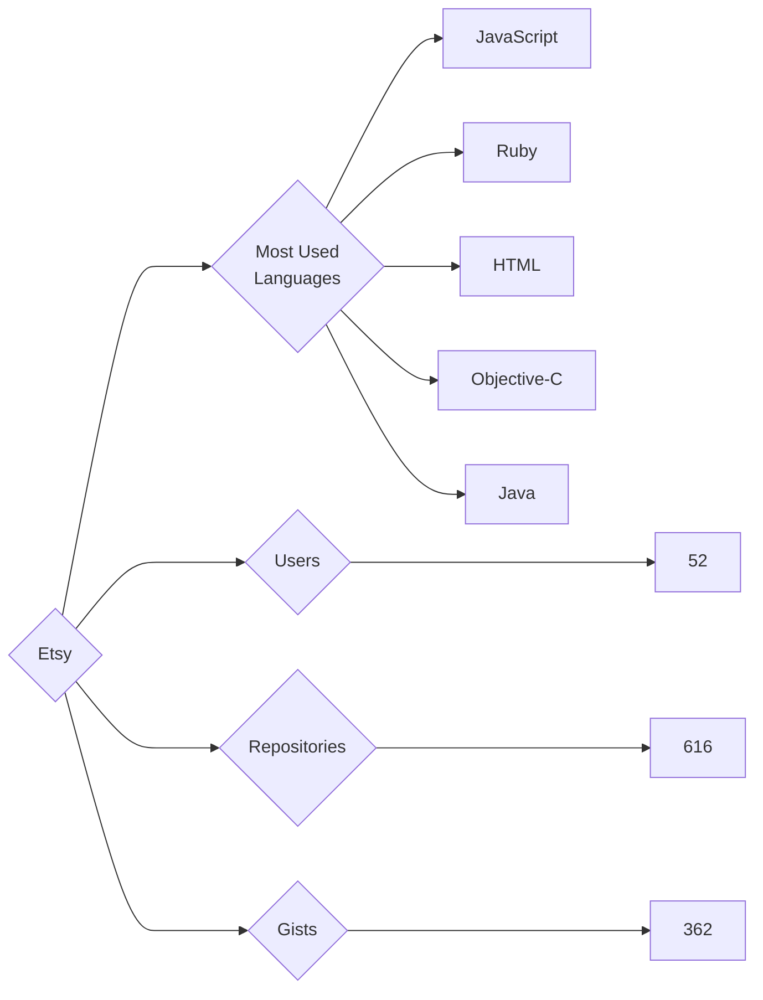

<h1 align="center">Etsy</h1>

```mermaid
graph LR
COMPANY_NAME{Etsy}
COMPANY_NAME ---> U{Users} ---> UN[52]
COMPANY_NAME ---> R{Repositories} ---> RN[616]
COMPANY_NAME ---> G{Gists} ---> GN[362]
COMPANY_NAME ---> ML{Most Used<br>Languages}
ML --> JavaScript[JavaScript]
ML --> Ruby[Ruby]
ML --> HTML[HTML]
ML --> Objective-C[Objective-C]
ML --> Java[Java]
```
