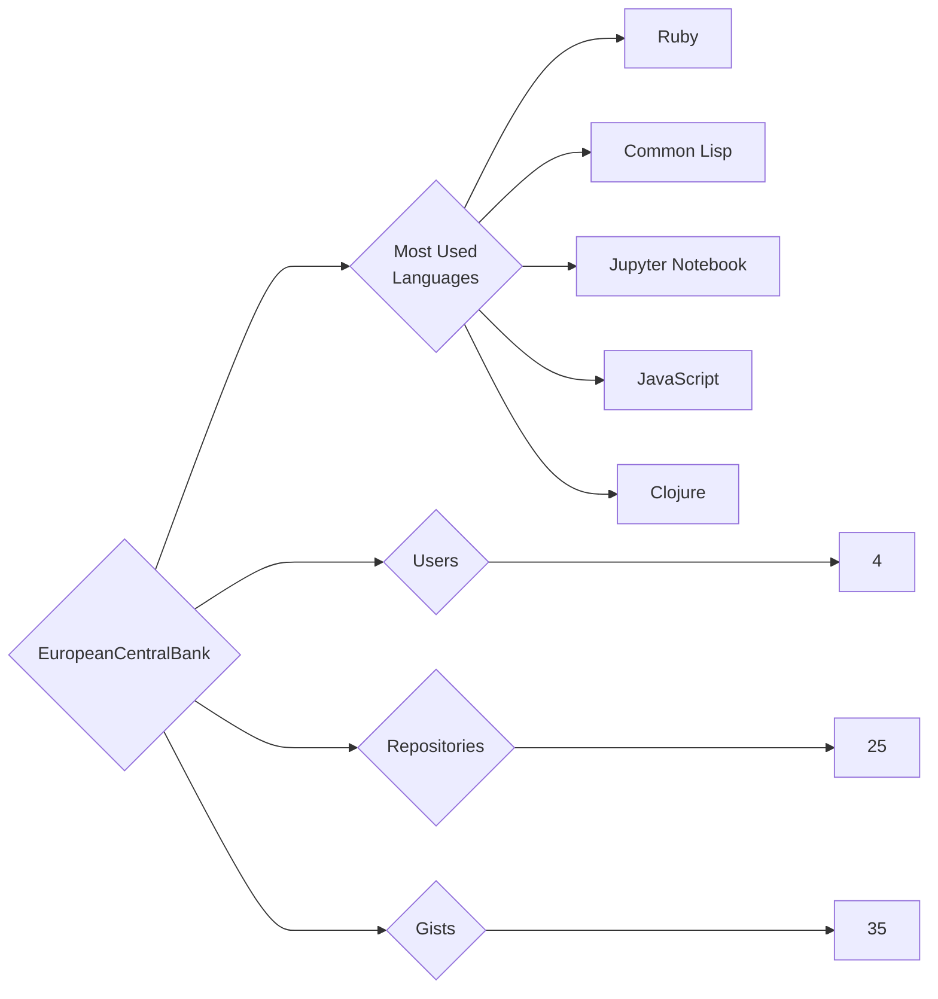

<h1 align="center">EuropeanCentralBank</h1>

```mermaid
graph LR
COMPANY_NAME{EuropeanCentralBank}
COMPANY_NAME ---> U{Users} ---> UN[4]
COMPANY_NAME ---> R{Repositories} ---> RN[25]
COMPANY_NAME ---> G{Gists} ---> GN[35]
COMPANY_NAME ---> ML{Most Used<br>Languages}
ML --> Ruby[Ruby]
ML --> Common_Lisp[Common Lisp]
ML --> Jupyter_Notebook[Jupyter Notebook]
ML --> JavaScript[JavaScript]
ML --> Clojure[Clojure]
```
