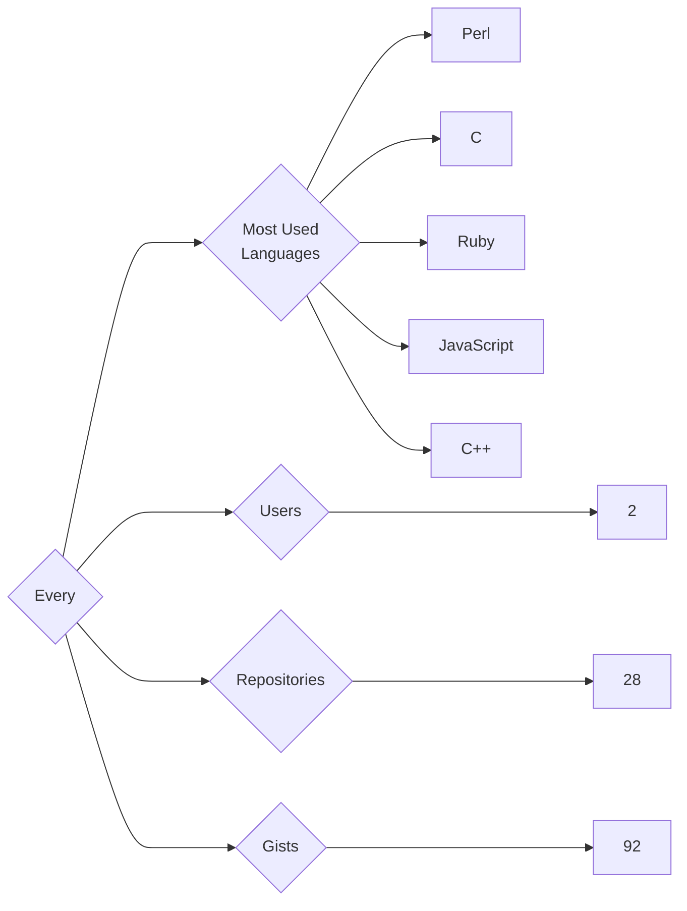

<h1 align="center">Every</h1>

```mermaid
graph LR
COMPANY_NAME{Every}
COMPANY_NAME ---> U{Users} ---> UN[2]
COMPANY_NAME ---> R{Repositories} ---> RN[28]
COMPANY_NAME ---> G{Gists} ---> GN[92]
COMPANY_NAME ---> ML{Most Used<br>Languages}
ML --> Perl[Perl]
ML --> C[C]
ML --> Ruby[Ruby]
ML --> JavaScript[JavaScript]
ML --> C++[C++]
```
