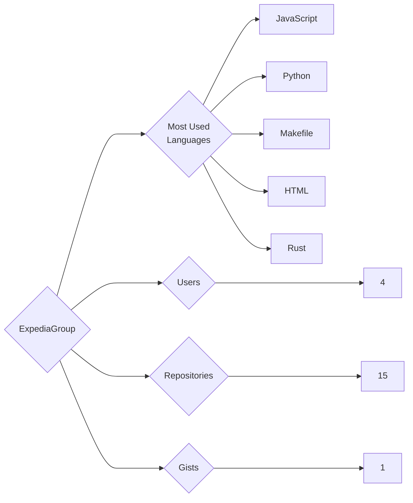

<h1 align="center">ExpediaGroup</h1>

```mermaid
graph LR
COMPANY_NAME{ExpediaGroup}
COMPANY_NAME ---> U{Users} ---> UN[4]
COMPANY_NAME ---> R{Repositories} ---> RN[15]
COMPANY_NAME ---> G{Gists} ---> GN[1]
COMPANY_NAME ---> ML{Most Used<br>Languages}
ML --> JavaScript[JavaScript]
ML --> Python[Python]
ML --> Makefile[Makefile]
ML --> HTML[HTML]
ML --> Rust[Rust]
```
