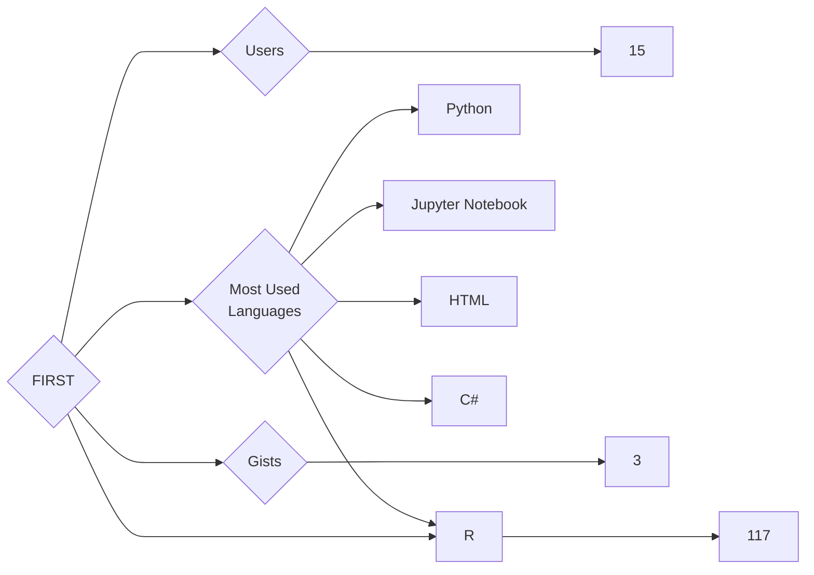

<h1 align="center">FIRST</h1>

```mermaid
graph LR
COMPANY_NAME{FIRST}
COMPANY_NAME ---> U{Users} ---> UN[15]
COMPANY_NAME ---> R{Repositories} ---> RN[117]
COMPANY_NAME ---> G{Gists} ---> GN[3]
COMPANY_NAME ---> ML{Most Used<br>Languages}
ML --> Python[Python]
ML --> Jupyter_Notebook[Jupyter Notebook]
ML --> R[R]
ML --> HTML[HTML]
ML --> C#[C#]
```
