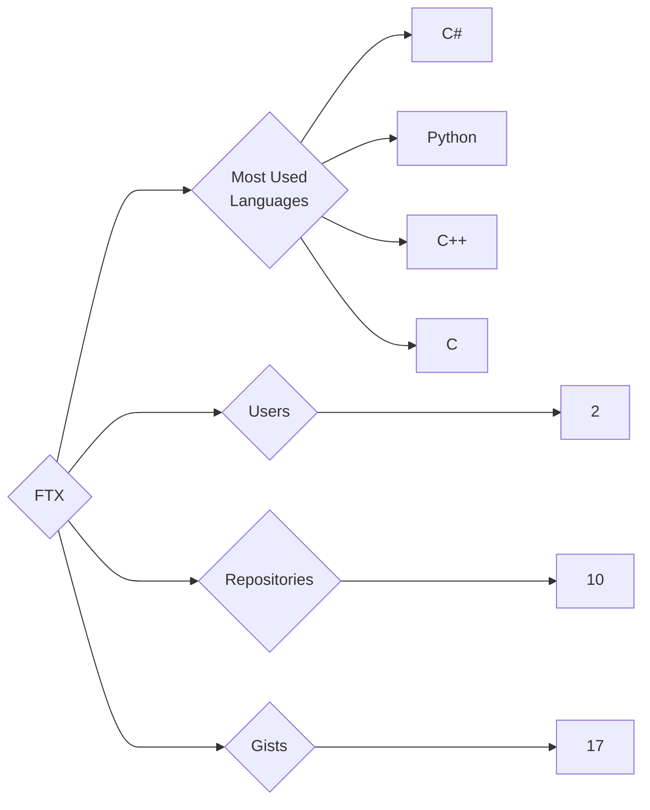

<h1 align="center">FTX</h1>

```mermaid
graph LR
COMPANY_NAME{FTX}
COMPANY_NAME ---> U{Users} ---> UN[2]
COMPANY_NAME ---> R{Repositories} ---> RN[10]
COMPANY_NAME ---> G{Gists} ---> GN[17]
COMPANY_NAME ---> ML{Most Used<br>Languages}
ML --> C#[C#]
ML --> Python[Python]
ML --> C++[C++]
ML --> C[C]
```
