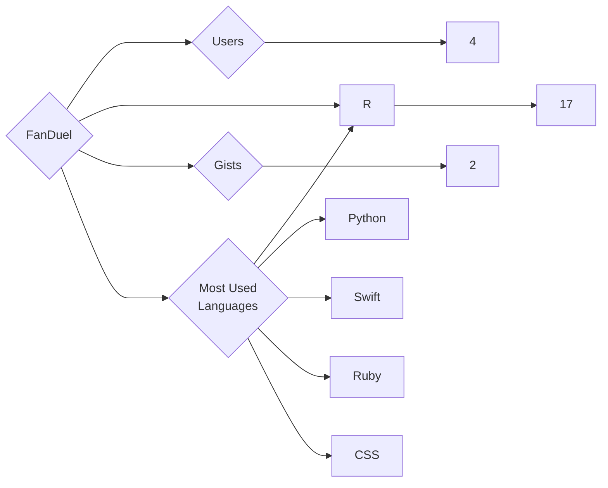

<h1 align="center">FanDuel</h1>

```mermaid
graph LR
COMPANY_NAME{FanDuel}
COMPANY_NAME ---> U{Users} ---> UN[4]
COMPANY_NAME ---> R{Repositories} ---> RN[17]
COMPANY_NAME ---> G{Gists} ---> GN[2]
COMPANY_NAME ---> ML{Most Used<br>Languages}
ML --> R[R]
ML --> Python[Python]
ML --> Swift[Swift]
ML --> Ruby[Ruby]
ML --> CSS[CSS]
```
