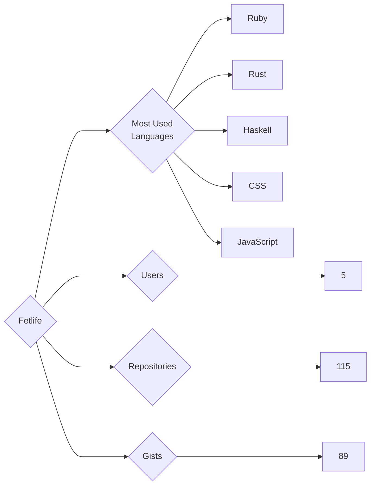

<h1 align="center">Fetlife</h1>

```mermaid
graph LR
COMPANY_NAME{Fetlife}
COMPANY_NAME ---> U{Users} ---> UN[5]
COMPANY_NAME ---> R{Repositories} ---> RN[115]
COMPANY_NAME ---> G{Gists} ---> GN[89]
COMPANY_NAME ---> ML{Most Used<br>Languages}
ML --> Ruby[Ruby]
ML --> Rust[Rust]
ML --> Haskell[Haskell]
ML --> CSS[CSS]
ML --> JavaScript[JavaScript]
```
