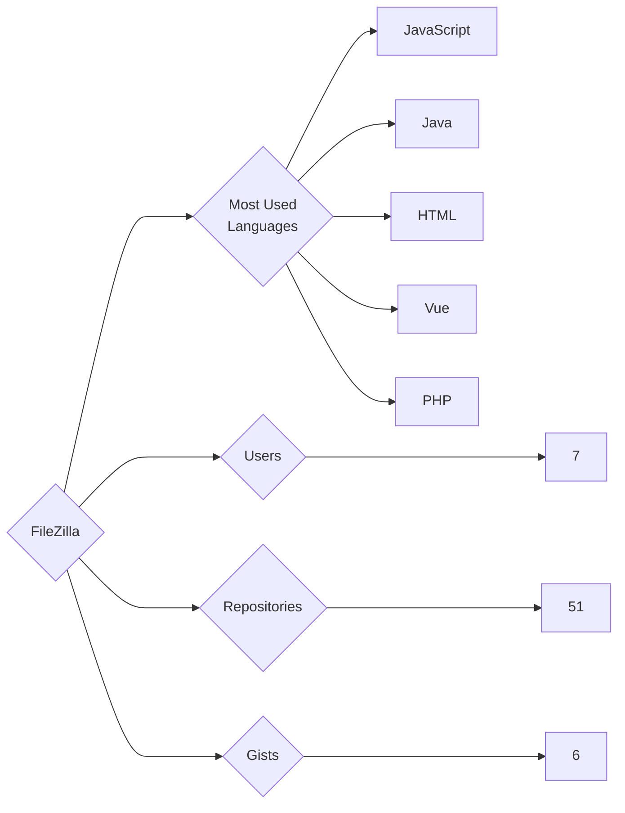

<h1 align="center">FileZilla</h1>

```mermaid
graph LR
COMPANY_NAME{FileZilla}
COMPANY_NAME ---> U{Users} ---> UN[7]
COMPANY_NAME ---> R{Repositories} ---> RN[51]
COMPANY_NAME ---> G{Gists} ---> GN[6]
COMPANY_NAME ---> ML{Most Used<br>Languages}
ML --> JavaScript[JavaScript]
ML --> Java[Java]
ML --> HTML[HTML]
ML --> Vue[Vue]
ML --> PHP[PHP]
```
