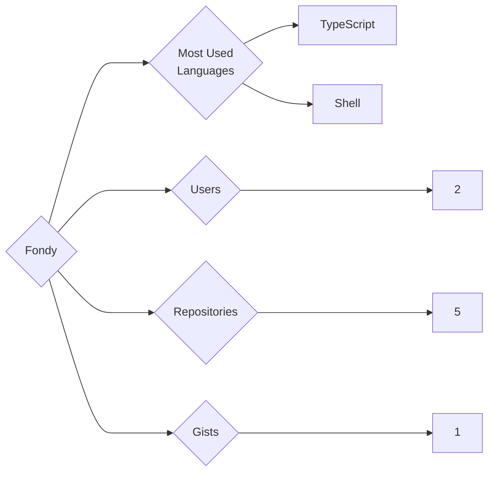

<h1 align="center">Fondy</h1>

```mermaid
graph LR
COMPANY_NAME{Fondy}
COMPANY_NAME ---> U{Users} ---> UN[2]
COMPANY_NAME ---> R{Repositories} ---> RN[5]
COMPANY_NAME ---> G{Gists} ---> GN[1]
COMPANY_NAME ---> ML{Most Used<br>Languages}
ML --> TypeScript[TypeScript]
ML --> Shell[Shell]
```
