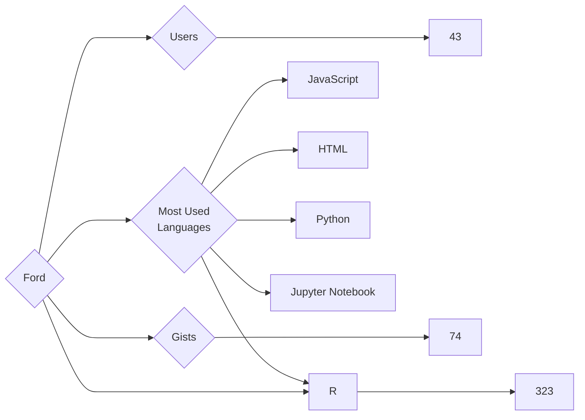

<h1 align="center">Ford</h1>

```mermaid
graph LR
COMPANY_NAME{Ford}
COMPANY_NAME ---> U{Users} ---> UN[43]
COMPANY_NAME ---> R{Repositories} ---> RN[323]
COMPANY_NAME ---> G{Gists} ---> GN[74]
COMPANY_NAME ---> ML{Most Used<br>Languages}
ML --> JavaScript[JavaScript]
ML --> HTML[HTML]
ML --> Python[Python]
ML --> R[R]
ML --> Jupyter_Notebook[Jupyter Notebook]
```
