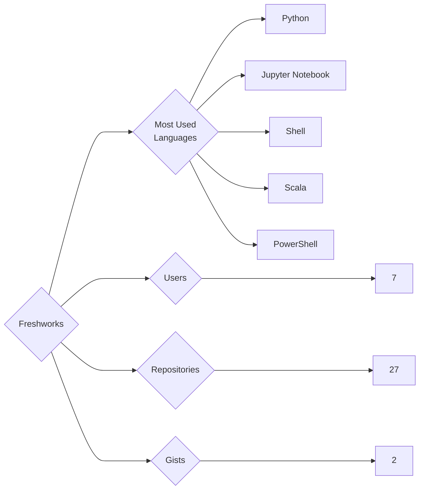

<h1 align="center">Freshworks</h1>

```mermaid
graph LR
COMPANY_NAME{Freshworks}
COMPANY_NAME ---> U{Users} ---> UN[7]
COMPANY_NAME ---> R{Repositories} ---> RN[27]
COMPANY_NAME ---> G{Gists} ---> GN[2]
COMPANY_NAME ---> ML{Most Used<br>Languages}
ML --> Python[Python]
ML --> Jupyter_Notebook[Jupyter Notebook]
ML --> Shell[Shell]
ML --> Scala[Scala]
ML --> PowerShell[PowerShell]
```
