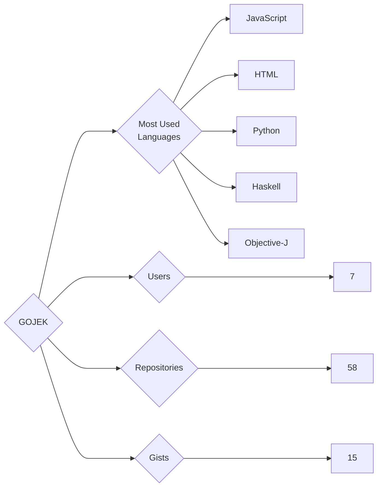

<h1 align="center">GOJEK</h1>

```mermaid
graph LR
COMPANY_NAME{GOJEK}
COMPANY_NAME ---> U{Users} ---> UN[7]
COMPANY_NAME ---> R{Repositories} ---> RN[58]
COMPANY_NAME ---> G{Gists} ---> GN[15]
COMPANY_NAME ---> ML{Most Used<br>Languages}
ML --> JavaScript[JavaScript]
ML --> HTML[HTML]
ML --> Python[Python]
ML --> Haskell[Haskell]
ML --> Objective-J[Objective-J]
```
