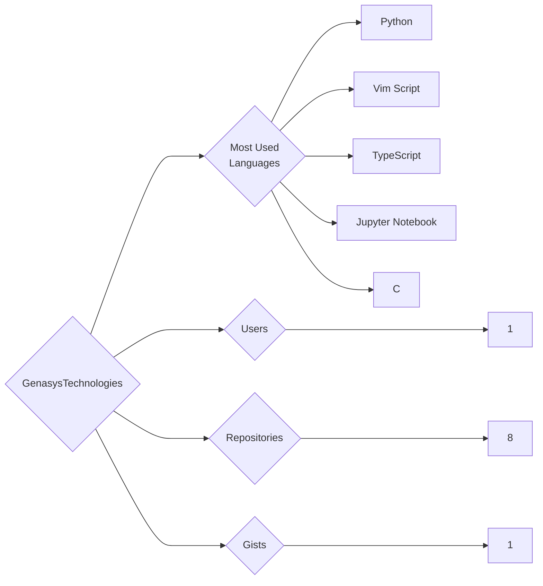

<h1 align="center">GenasysTechnologies</h1>

```mermaid
graph LR
COMPANY_NAME{GenasysTechnologies}
COMPANY_NAME ---> U{Users} ---> UN[1]
COMPANY_NAME ---> R{Repositories} ---> RN[8]
COMPANY_NAME ---> G{Gists} ---> GN[1]
COMPANY_NAME ---> ML{Most Used<br>Languages}
ML --> Python[Python]
ML --> Vim_Script[Vim Script]
ML --> TypeScript[TypeScript]
ML --> Jupyter_Notebook[Jupyter Notebook]
ML --> C[C]
```
