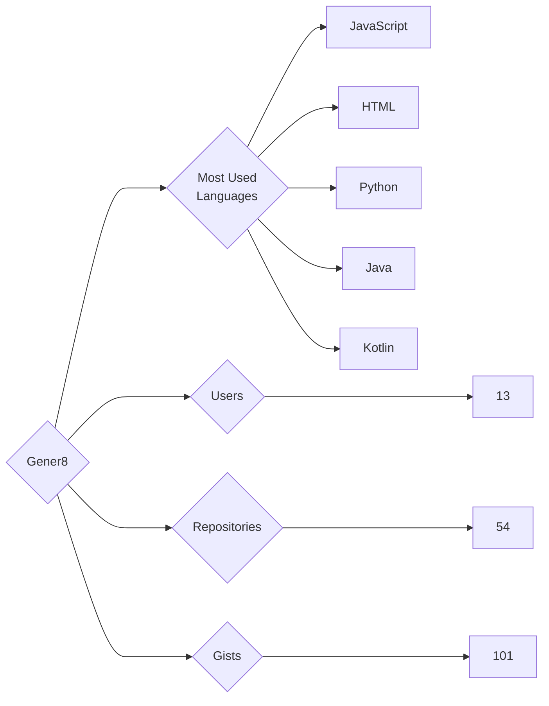

<h1 align="center">Gener8</h1>

```mermaid
graph LR
COMPANY_NAME{Gener8}
COMPANY_NAME ---> U{Users} ---> UN[13]
COMPANY_NAME ---> R{Repositories} ---> RN[54]
COMPANY_NAME ---> G{Gists} ---> GN[101]
COMPANY_NAME ---> ML{Most Used<br>Languages}
ML --> JavaScript[JavaScript]
ML --> HTML[HTML]
ML --> Python[Python]
ML --> Java[Java]
ML --> Kotlin[Kotlin]
```
