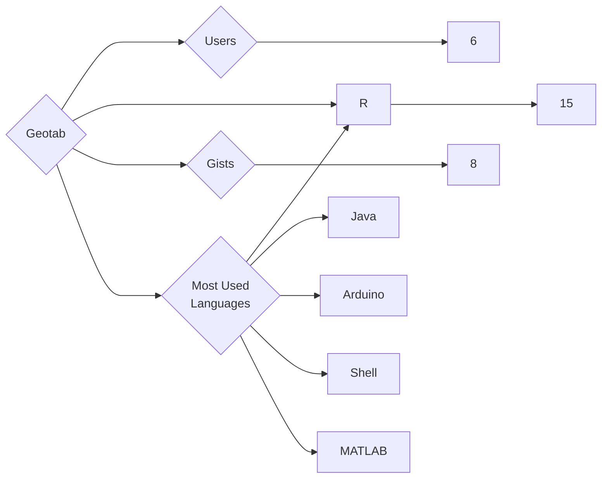

<h1 align="center">Geotab</h1>

```mermaid
graph LR
COMPANY_NAME{Geotab}
COMPANY_NAME ---> U{Users} ---> UN[6]
COMPANY_NAME ---> R{Repositories} ---> RN[15]
COMPANY_NAME ---> G{Gists} ---> GN[8]
COMPANY_NAME ---> ML{Most Used<br>Languages}
ML --> R[R]
ML --> Java[Java]
ML --> Arduino[Arduino]
ML --> Shell[Shell]
ML --> MATLAB[MATLAB]
```
