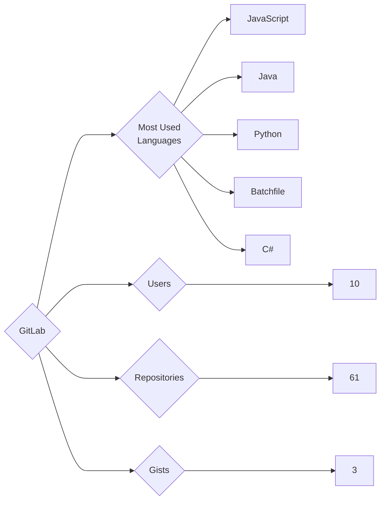

<h1 align="center">GitLab</h1>

```mermaid
graph LR
COMPANY_NAME{GitLab}
COMPANY_NAME ---> U{Users} ---> UN[10]
COMPANY_NAME ---> R{Repositories} ---> RN[61]
COMPANY_NAME ---> G{Gists} ---> GN[3]
COMPANY_NAME ---> ML{Most Used<br>Languages}
ML --> JavaScript[JavaScript]
ML --> Java[Java]
ML --> Python[Python]
ML --> Batchfile[Batchfile]
ML --> C#[C#]
```
