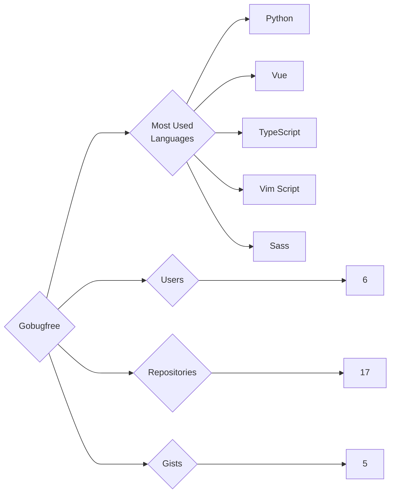

<h1 align="center">Gobugfree</h1>

```mermaid
graph LR
COMPANY_NAME{Gobugfree}
COMPANY_NAME ---> U{Users} ---> UN[6]
COMPANY_NAME ---> R{Repositories} ---> RN[17]
COMPANY_NAME ---> G{Gists} ---> GN[5]
COMPANY_NAME ---> ML{Most Used<br>Languages}
ML --> Python[Python]
ML --> Vue[Vue]
ML --> TypeScript[TypeScript]
ML --> Vim_Script[Vim Script]
ML --> Sass[Sass]
```
