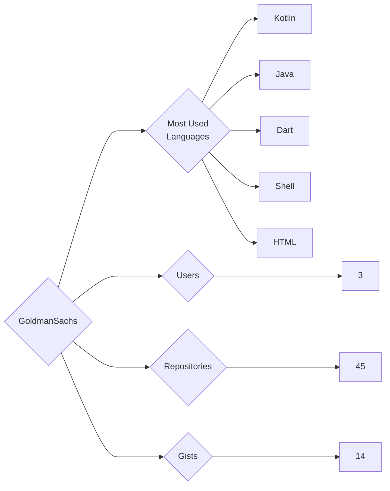

<h1 align="center">GoldmanSachs</h1>

```mermaid
graph LR
COMPANY_NAME{GoldmanSachs}
COMPANY_NAME ---> U{Users} ---> UN[3]
COMPANY_NAME ---> R{Repositories} ---> RN[45]
COMPANY_NAME ---> G{Gists} ---> GN[14]
COMPANY_NAME ---> ML{Most Used<br>Languages}
ML --> Kotlin[Kotlin]
ML --> Java[Java]
ML --> Dart[Dart]
ML --> Shell[Shell]
ML --> HTML[HTML]
```
