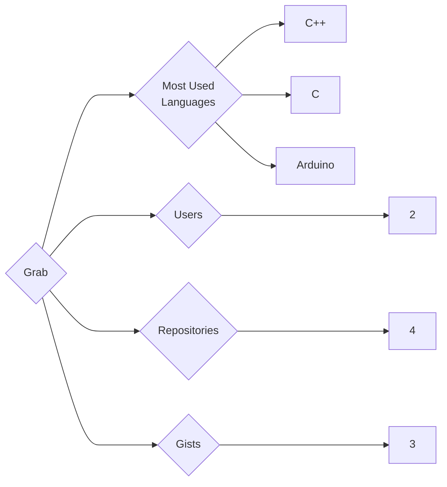

<h1 align="center">Grab</h1>

```mermaid
graph LR
COMPANY_NAME{Grab}
COMPANY_NAME ---> U{Users} ---> UN[2]
COMPANY_NAME ---> R{Repositories} ---> RN[4]
COMPANY_NAME ---> G{Gists} ---> GN[3]
COMPANY_NAME ---> ML{Most Used<br>Languages}
ML --> C++[C++]
ML --> C[C]
ML --> Arduino[Arduino]
```
