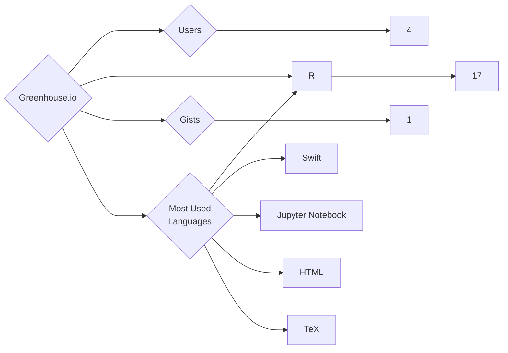

<h1 align="center">Greenhouse.io</h1>

```mermaid
graph LR
COMPANY_NAME{Greenhouse.io}
COMPANY_NAME ---> U{Users} ---> UN[4]
COMPANY_NAME ---> R{Repositories} ---> RN[17]
COMPANY_NAME ---> G{Gists} ---> GN[1]
COMPANY_NAME ---> ML{Most Used<br>Languages}
ML --> R[R]
ML --> Swift[Swift]
ML --> Jupyter_Notebook[Jupyter Notebook]
ML --> HTML[HTML]
ML --> TeX[TeX]
```
