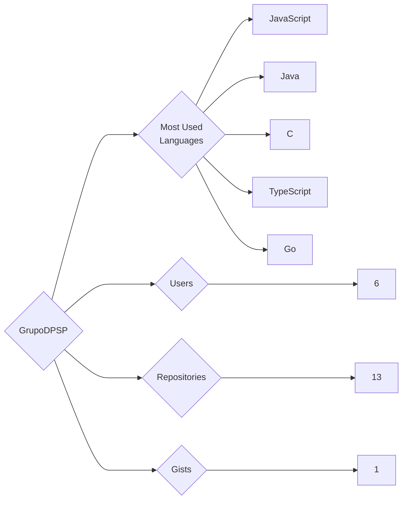

<h1 align="center">GrupoDPSP</h1>

```mermaid
graph LR
COMPANY_NAME{GrupoDPSP}
COMPANY_NAME ---> U{Users} ---> UN[6]
COMPANY_NAME ---> R{Repositories} ---> RN[13]
COMPANY_NAME ---> G{Gists} ---> GN[1]
COMPANY_NAME ---> ML{Most Used<br>Languages}
ML --> JavaScript[JavaScript]
ML --> Java[Java]
ML --> C[C]
ML --> TypeScript[TypeScript]
ML --> Go[Go]
```
