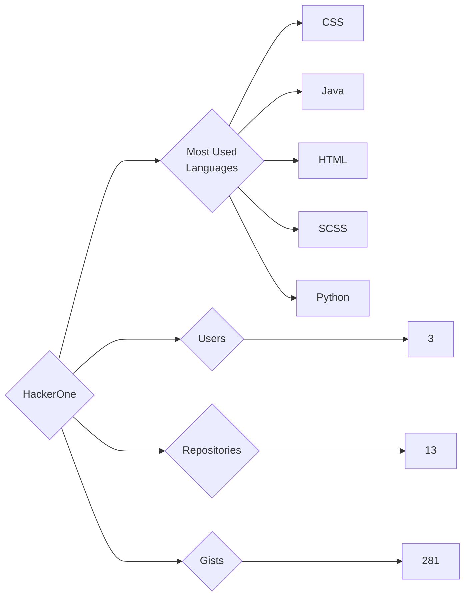

<h1 align="center">HackerOne</h1>

```mermaid
graph LR
COMPANY_NAME{HackerOne}
COMPANY_NAME ---> U{Users} ---> UN[3]
COMPANY_NAME ---> R{Repositories} ---> RN[13]
COMPANY_NAME ---> G{Gists} ---> GN[281]
COMPANY_NAME ---> ML{Most Used<br>Languages}
ML --> CSS[CSS]
ML --> Java[Java]
ML --> HTML[HTML]
ML --> SCSS[SCSS]
ML --> Python[Python]
```
