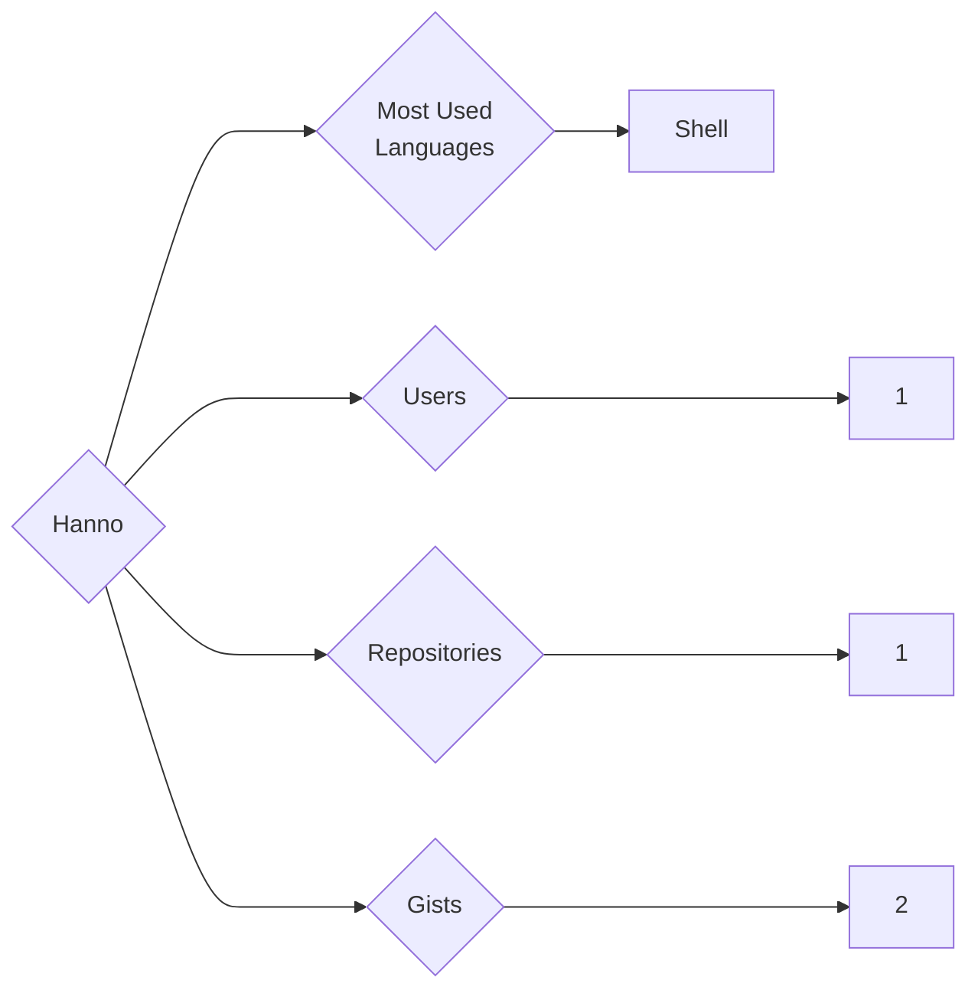

<h1 align="center">Hanno</h1>

```mermaid
graph LR
COMPANY_NAME{Hanno}
COMPANY_NAME ---> U{Users} ---> UN[1]
COMPANY_NAME ---> R{Repositories} ---> RN[1]
COMPANY_NAME ---> G{Gists} ---> GN[2]
COMPANY_NAME ---> ML{Most Used<br>Languages}
ML --> Shell[Shell]
```
