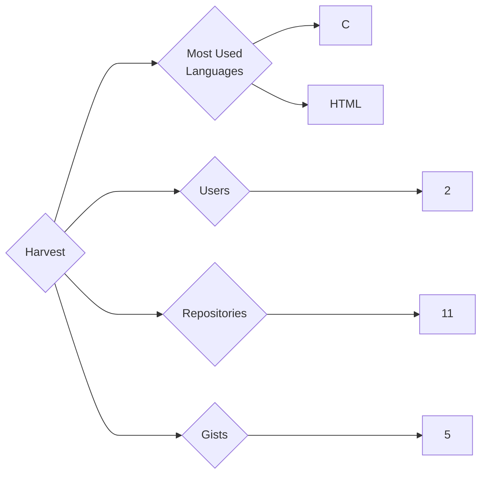

<h1 align="center">Harvest</h1>

```mermaid
graph LR
COMPANY_NAME{Harvest}
COMPANY_NAME ---> U{Users} ---> UN[2]
COMPANY_NAME ---> R{Repositories} ---> RN[11]
COMPANY_NAME ---> G{Gists} ---> GN[5]
COMPANY_NAME ---> ML{Most Used<br>Languages}
ML --> C[C]
ML --> HTML[HTML]
```
