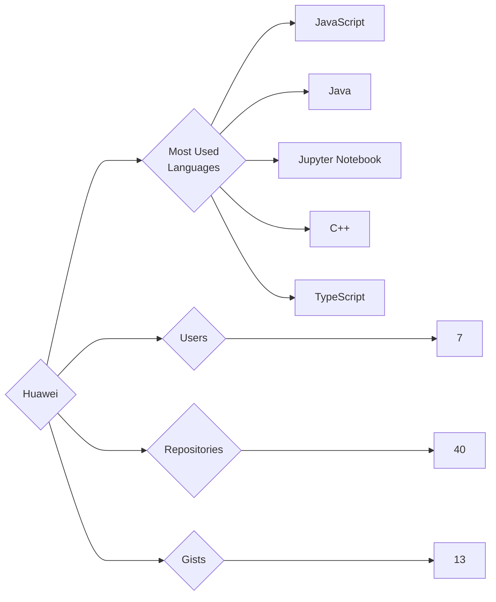

<h1 align="center">Huawei</h1>

```mermaid
graph LR
COMPANY_NAME{Huawei}
COMPANY_NAME ---> U{Users} ---> UN[7]
COMPANY_NAME ---> R{Repositories} ---> RN[40]
COMPANY_NAME ---> G{Gists} ---> GN[13]
COMPANY_NAME ---> ML{Most Used<br>Languages}
ML --> JavaScript[JavaScript]
ML --> Java[Java]
ML --> Jupyter_Notebook[Jupyter Notebook]
ML --> C++[C++]
ML --> TypeScript[TypeScript]
```
