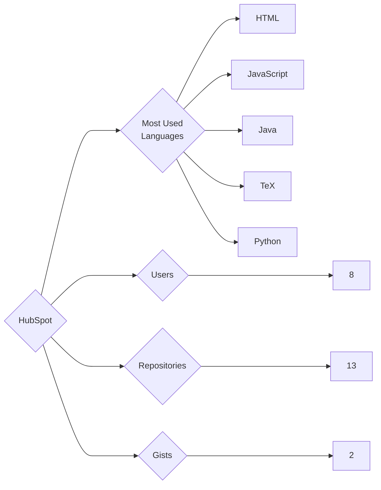

<h1 align="center">HubSpot</h1>

```mermaid
graph LR
COMPANY_NAME{HubSpot}
COMPANY_NAME ---> U{Users} ---> UN[8]
COMPANY_NAME ---> R{Repositories} ---> RN[13]
COMPANY_NAME ---> G{Gists} ---> GN[2]
COMPANY_NAME ---> ML{Most Used<br>Languages}
ML --> HTML[HTML]
ML --> JavaScript[JavaScript]
ML --> Java[Java]
ML --> TeX[TeX]
ML --> Python[Python]
```
