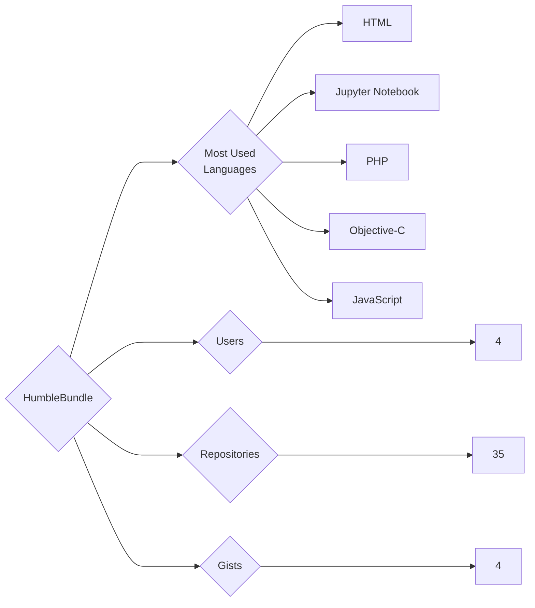

<h1 align="center">HumbleBundle</h1>

```mermaid
graph LR
COMPANY_NAME{HumbleBundle}
COMPANY_NAME ---> U{Users} ---> UN[4]
COMPANY_NAME ---> R{Repositories} ---> RN[35]
COMPANY_NAME ---> G{Gists} ---> GN[4]
COMPANY_NAME ---> ML{Most Used<br>Languages}
ML --> HTML[HTML]
ML --> Jupyter_Notebook[Jupyter Notebook]
ML --> PHP[PHP]
ML --> Objective-C[Objective-C]
ML --> JavaScript[JavaScript]
```
