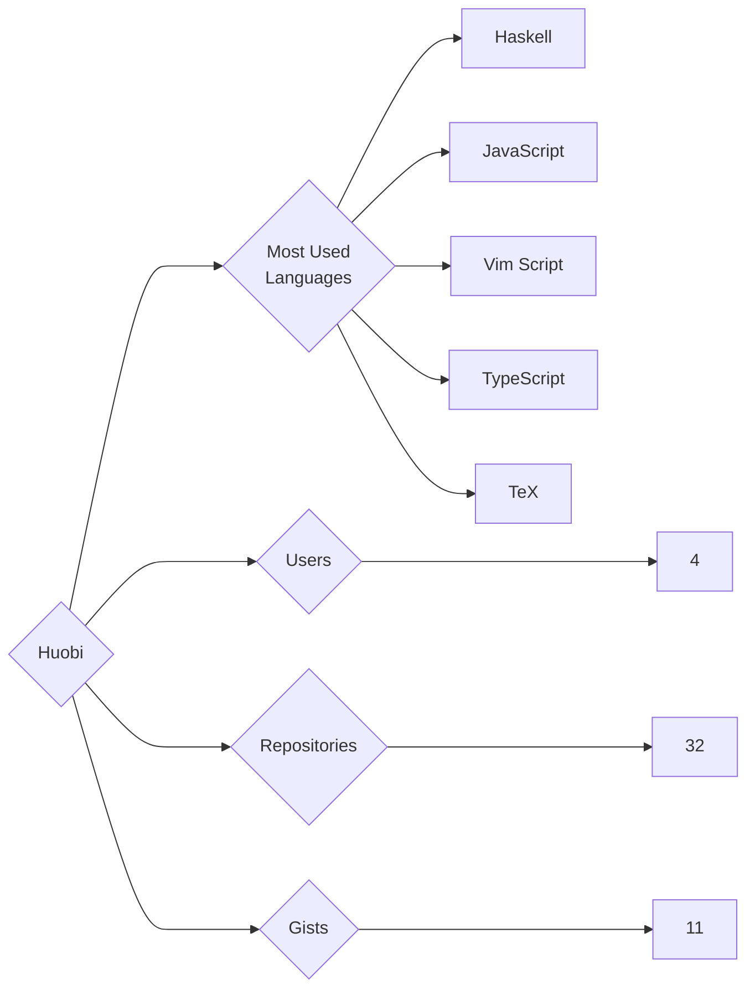

<h1 align="center">Huobi</h1>

```mermaid
graph LR
COMPANY_NAME{Huobi}
COMPANY_NAME ---> U{Users} ---> UN[4]
COMPANY_NAME ---> R{Repositories} ---> RN[32]
COMPANY_NAME ---> G{Gists} ---> GN[11]
COMPANY_NAME ---> ML{Most Used<br>Languages}
ML --> Haskell[Haskell]
ML --> JavaScript[JavaScript]
ML --> Vim_Script[Vim Script]
ML --> TypeScript[TypeScript]
ML --> TeX[TeX]
```
