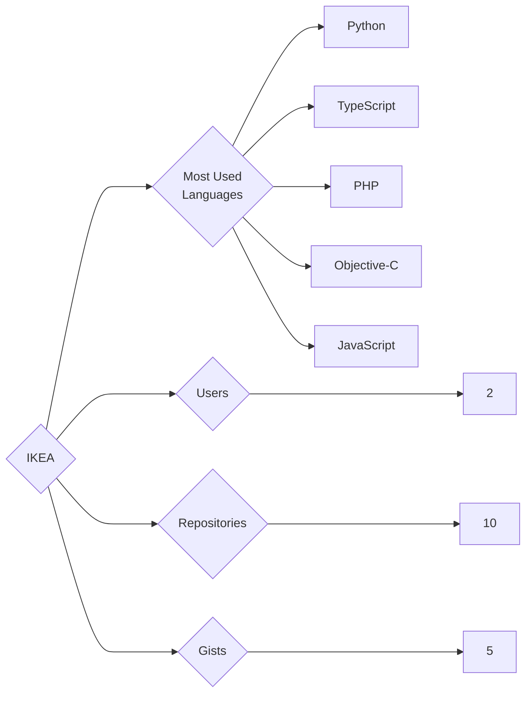

<h1 align="center">IKEA</h1>

```mermaid
graph LR
COMPANY_NAME{IKEA}
COMPANY_NAME ---> U{Users} ---> UN[2]
COMPANY_NAME ---> R{Repositories} ---> RN[10]
COMPANY_NAME ---> G{Gists} ---> GN[5]
COMPANY_NAME ---> ML{Most Used<br>Languages}
ML --> Python[Python]
ML --> TypeScript[TypeScript]
ML --> PHP[PHP]
ML --> Objective-C[Objective-C]
ML --> JavaScript[JavaScript]
```
