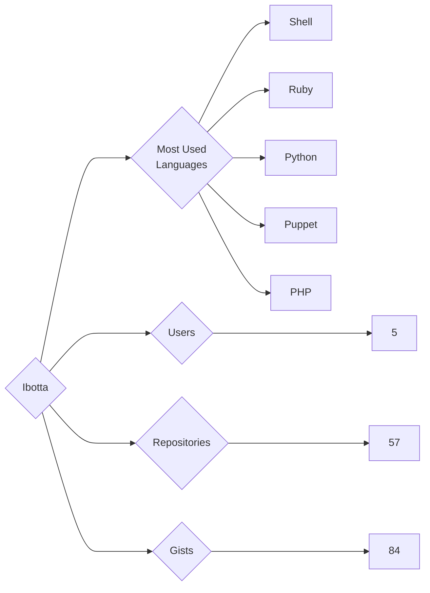

<h1 align="center">Ibotta</h1>

```mermaid
graph LR
COMPANY_NAME{Ibotta}
COMPANY_NAME ---> U{Users} ---> UN[5]
COMPANY_NAME ---> R{Repositories} ---> RN[57]
COMPANY_NAME ---> G{Gists} ---> GN[84]
COMPANY_NAME ---> ML{Most Used<br>Languages}
ML --> Shell[Shell]
ML --> Ruby[Ruby]
ML --> Python[Python]
ML --> Puppet[Puppet]
ML --> PHP[PHP]
```
