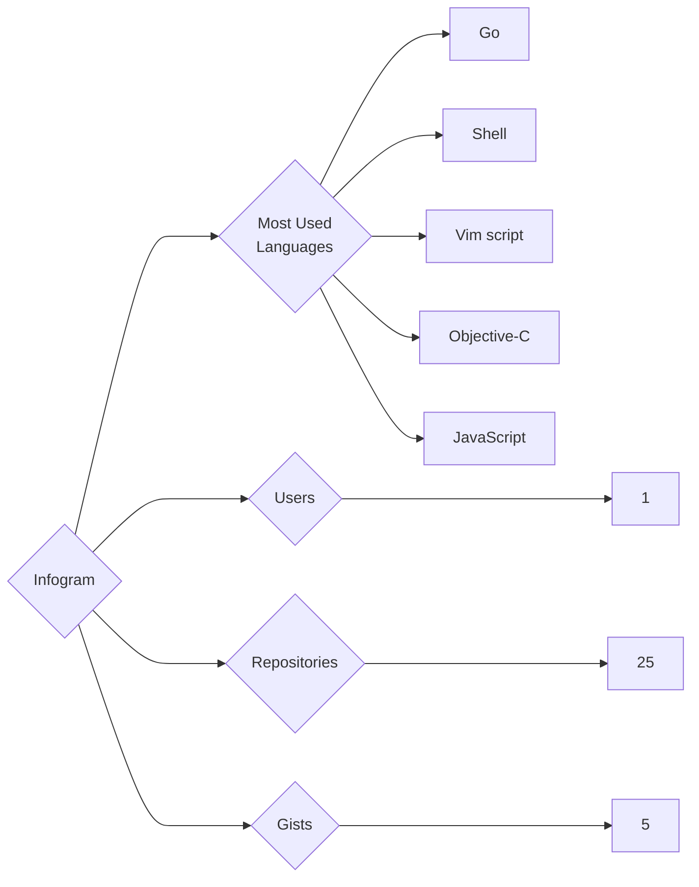

<h1 align="center">Infogram</h1>

```mermaid
graph LR
COMPANY_NAME{Infogram}
COMPANY_NAME ---> U{Users} ---> UN[1]
COMPANY_NAME ---> R{Repositories} ---> RN[25]
COMPANY_NAME ---> G{Gists} ---> GN[5]
COMPANY_NAME ---> ML{Most Used<br>Languages}
ML --> Go[Go]
ML --> Shell[Shell]
ML --> Vim_script[Vim script]
ML --> Objective-C[Objective-C]
ML --> JavaScript[JavaScript]
```
