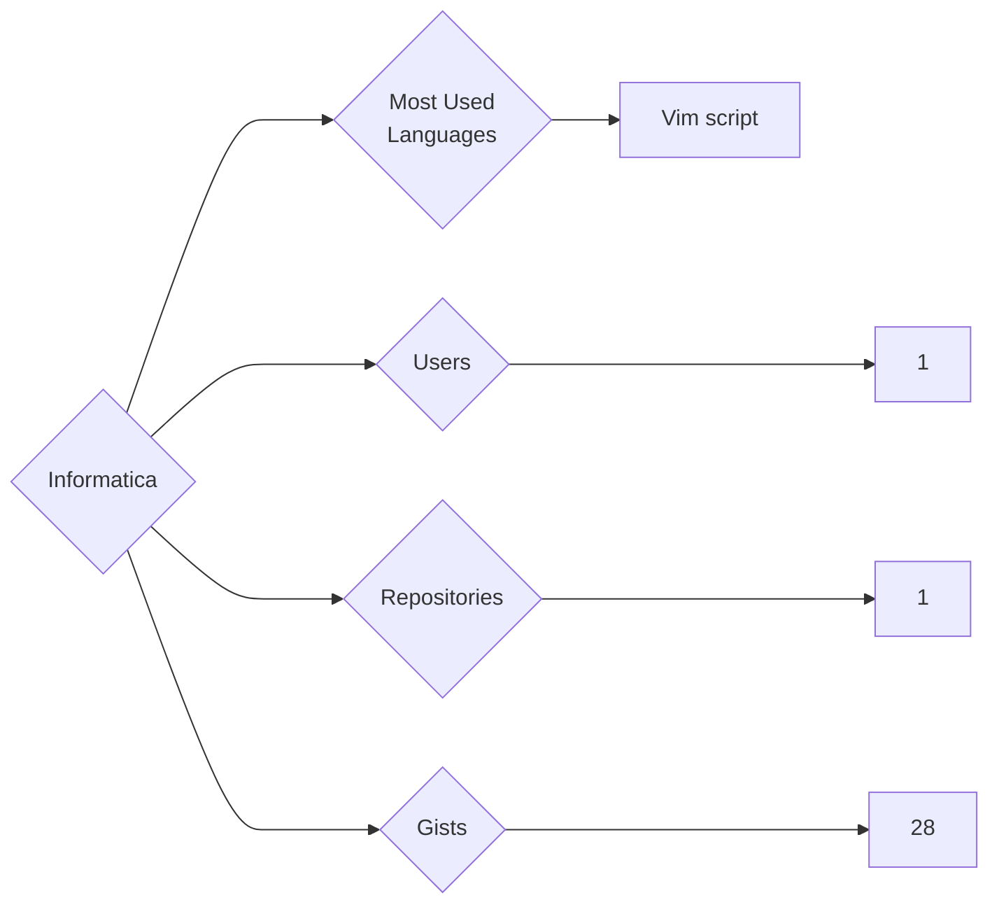

<h1 align="center">Informatica</h1>

```mermaid
graph LR
COMPANY_NAME{Informatica}
COMPANY_NAME ---> U{Users} ---> UN[1]
COMPANY_NAME ---> R{Repositories} ---> RN[1]
COMPANY_NAME ---> G{Gists} ---> GN[28]
COMPANY_NAME ---> ML{Most Used<br>Languages}
ML --> Vim_script[Vim script]
```
